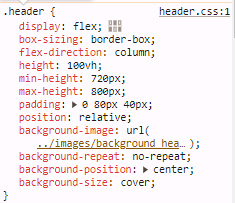
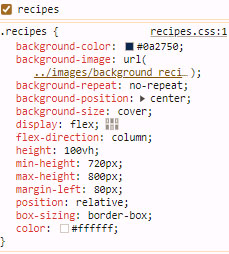
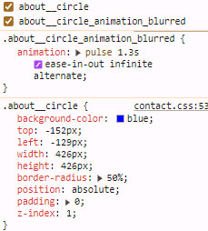

# Triple Peaks Coffee Shop [>](./index.html)

This is the second project of the Software Engineering program at TripleTen. It was created using HTML and CSS, based on the design brief.

## Project features

- Semantic HTML5
- Flexbox
- Positioning
- Flat BEM file structure
- A custom form
- CSS animation and transform

### Plan on improving the project

**1.** I would like to see the page be flexible for all mobile devices.

**2.** I would prefer to see a calendar option on the reservation page.

### Some CSS to pay attention to or use for reference

### Regarding the _about_ animation

Here is the animation CSS for reference _Take note that the div has 2 classes_

          

          

@keyframes pulse {
from {
opacity: 0;
transform: scale(1);
}
50% {
opacity: 0.6;
transform: scale(1.25);
}
to {
opacity: 0;
transform: scale(1.25);
}
}
